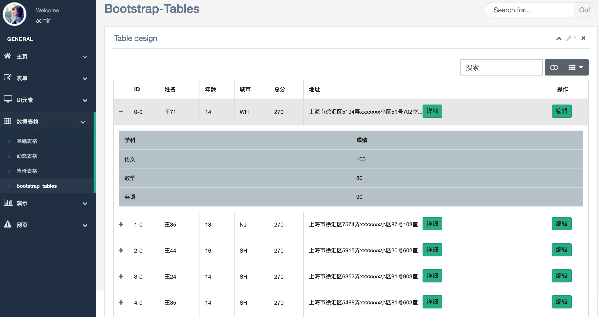
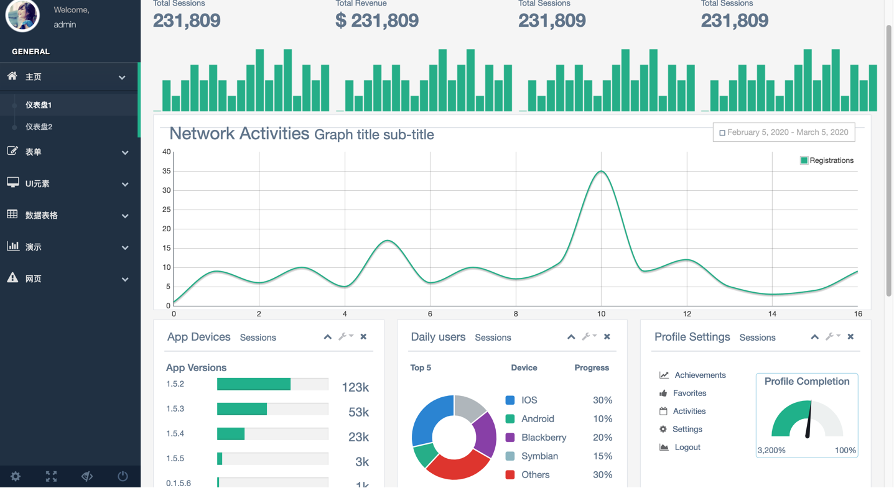
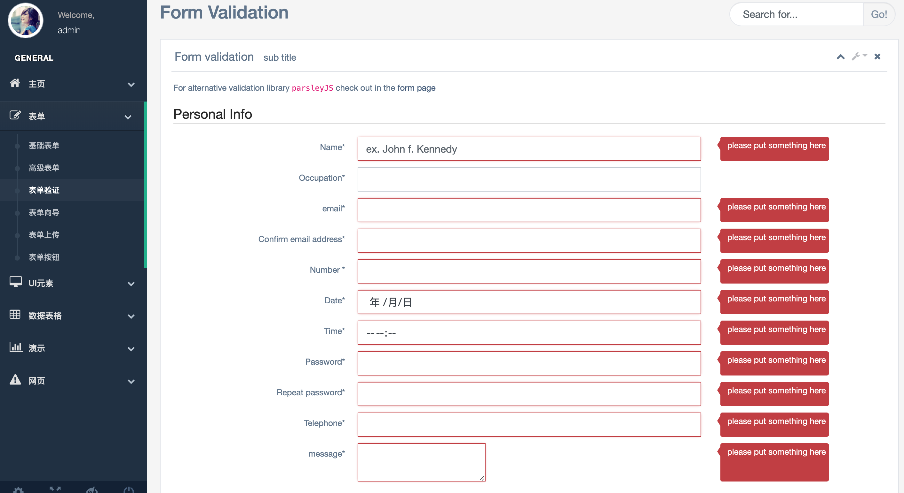

## Django admin

基于django，jquery ,bootstrap4的一个后台管理系统

VERSION = "0.1.1"

## demo
* http://121.199.79.74:8001
* admin   
* admin@123







## 获取安装

执行以下命令，就能够在你的`GOPATH/src` 目录下发现beego admin
```bash
$ git clone https://github.com/ntuwang/djadmin
```

## 初次使用
如果只是体验可以直接用sqlite3.
### 配置数据库

修改 setting.py 修改数据库配置，如下所示：
```python
DATABASES = {
        'default': {
            'ENGINE': 'django.db.backends.mysql',
            'NAME': 'djadmin',
            'USER': 'root',
            'PASSWORD': 'password',
            'HOST': 'host',
            'PORT': 3306,
        }
    }
```
### 创建数据库
mysql数据库中执行:
```mysql
CREATE DATABASE `djadmin`  DEFAULT CHARACTER SET utf8mb4 COLLATE utf8mb4_unicode_ci;
```
然后终端下执行:
```bash
python manage.py makemigrations
python manage.py migrate
```
### 创建超级用户

```bash
python manage.py createsuperuser
```

### 导入数据
进入数据库执行
```
source init.sql
```
### 开始运行
```bash
python manage.py runserver
```

好了，现在可以通过浏览器地址访问了[`http://localhost:8000/`](http://localhost:8080/)

有问题在issue反馈吧